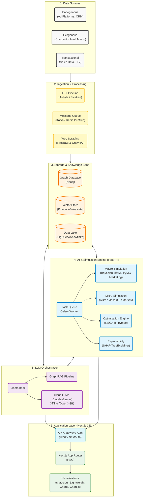

# System Architecture

## Graphical Architecture

## 1. Data Sources

Three classes of data feed the ingestion pipeline:
- **Endogenous inputs:** Ad platforms (Meta, Google), CRM, and promotional data.
- **Exogenous inputs:** Competitor share of voice (scraped via Firecrawl and Crawl4AI) and macroeconomic time-series.
- **Transactional inputs:** Historical revenue logs, conversion events, and LTV.

## 2. Ingestion & Processing

Batch data is securely pulled by ETL tools (Airbyte or Fivetran). Real-time scraping events and streaming telemetry flow through a message queue (Kafka or Redis Pub/Sub), decoupling ingestion from downstream processing. Web scraping is handled by **Firecrawl** (for complex targets) and **Crawl4AI** (for high-volume undefended targets).

## 3. Storage & Knowledge Base

- **Neo4j (Graph DB):** Serves as the primary relationship mapper, storing the marketing input matrix as interconnected nodes and edges.
- **Pinecone / Weaviate (Vector Store):** Stores embeddings of creative assets and textual campaign data.
- **BigQuery / Snowflake (Data Lake):** Cold-storage repository for raw, unstructured historical logs.

## 4. AI & Simulation Engine

Heavy mathematical simulations execute in a dedicated Python environment (FastAPI), decoupled via a Celery task queue:
- **Macro-Simulation:** Bayesian MMM via **PyMC-Marketing** performs top-down budget forecasting.
- **Micro-Simulation:** ABM powered by **Mesa 3.0** and Markov Chains simulate granular user journeys.
- **Optimization Engine:** **NSGA-II Genetic Algorithm (pymoo)** evaluates thousands of budget combinations to find the Pareto frontier.
- **SHAP Explainability:** A SHAP TreeExplainer computes the exact marginal contribution of input features before passing outputs to the LLM, guaranteeing deterministic explainability.

## 5. LLM Orchestration

Orchestrated by **LlamaIndex**, this layer bridges raw simulation outputs and natural-language explainability via the **GraphRAG** pipeline. Cloud inference uses **Claude 3.5 Sonnet** or **Gemini 1.5 Flash**. An offline fallback deploys **Qwen3-8B** locally via Ollama to ensure accessibility on limited network infrastructure.

## 6. Application Layer

- **Frontend:** **Next.js 15** with React Server Components (RSC) renders heavy data server-side, keeping the client bundle lean.
- **Authentication:** Managed by Clerk or NextAuth.
- **Visualizations:** Built with shadcn/ui, **Lightweight Charts**, and **Chart.js**.
- **Localization:** Full Bangla i18n via `next-intl`. 
- **Edge Optimization:** Aggressive low-bandwidth optimizations on Vercel ensure the dashboard is accessible on 2G/3G mobile infrastructure.